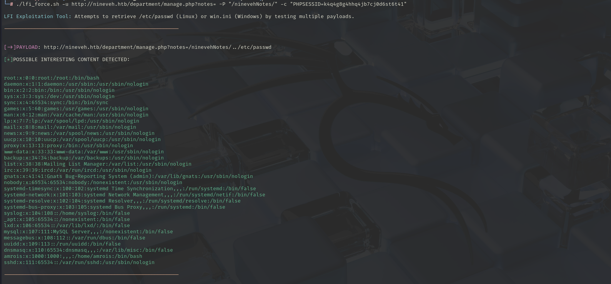

# LFI Force

**LFI Force** is a Bash script designed to help test Local File Inclusion (LFI) vulnerabilities in web applications. The script attempts to retrieve sensitive files like `/etc/passwd` on Linux systems and `win.ini` on Windows systems using various LFI payloads.

## Features

- Supports Linux and Windows targets.
- Allows custom prefixes before payloads.
- Optional cookie support.
- Automatically decodes and filters responses to show potentially interesting content.
- Color-coded output for easier readability.

## Requirements

- Bash
- curl
- Python 3 (for URL decoding)

## Demo



## Usage

```bash
./lfi_force.sh -u URL_BASE [-P PREFIX] [-c "cookie"] [-k] [-s linux|windows]
